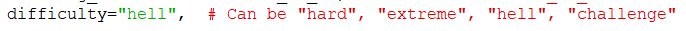

# AVAILABLE BOTS

## Demon farming script

In `scripts/DemonFarmer.py`, it's a script that looks for real-time demon fights in a non-stopping loop. It's an infinite source of demon materials without wasting any resource! It accepts any demon, from Red to Indura.
So far, it only accepts the "Hell" difficulty (except for Indura, which accepts all).

* You can find all the setup options inside the corresponding GUI tab.
* You may need to play with "time to sleep" value, which determines how many seconds to wait before accepting an invite.
⚠ Lower than `9`, you'll risk wasting all your 3 daily demon invites.

## Demon King farmer

Farms the Demon King fight (hard mode, it's the most efficient one!). 
You're responsible for in-game pre-setting what coins to use.

**Requirements**:
* Team A: Skuld (att/crit), any 3 boosters. Try having all 3 colors (red/green/blue).
* Team B: Won't be used.

## Guild Boss farmer

It farms Guild Boss uninterruptedly. Should be used during stsamina reduction days only!

**Requirement:** Start the bot from within a fight already.

## Rat Farmer

Only farms floors 1 and 2 (rinse and repeat). 

**Requirements**
* Team (in this order): LR Liz, Blue Valenti, Red Jorm, King-Diane

## Floor 4 of Bird

You can use any team, but recommended:
* Traitor Meli / Green Tyr
* Thor
* Blue Megellda
* Shion

**Important**: If you use Diane, place her on the rightmost position in the team.

## Floor 4 of Deer

In `scripts/DeerFloor4Farmer.py`. It needs the following team:
* Thor (att/crit damage)
* Green Jorm (att/def)
* Freyr (att/crit damage)
* Green Tyr (preferable) / Green Hel. Both with (att/crit damage)

Start the script from within the Deer floor selection screen. 
**Note** that all units should have attack gear. The current expected win rate is of 60% with Tyr, 30% with Hel. 

## Floor 4 of Dogs

In `scripts/DogsFloor4Farmer.py`. It needs the following team (left to right):
* Escalin
* Lillia, Cusack, or Roxy (Roxy recommended)
* Nasiens
* Thonar

Start the script from within the Dogs floor selection screen. 

**Disclaimer**: Due to RNG, this bot is in *beta* testing mode and will fail a lot. If you try it, please join our Discord and let us know of specific logic/strategies you'd fix/follow instead. 

## Hraesvelgr (Bird) farming script

It's named `scripts/BirdFarmer.py`, and it does what its name says: It farms floors 1-3 of the Bird uninterruptedly, even when stamina is depleted or a fight is lost.

Requirements:
1. Start by being in a screen that's in the path of going to the bird (i.e.: tavern, battle menu, or bird menu).
2. Have the team ready with the proper gear. This doesn't mean "saved" (this will be handled by the script automatically), but rather just set up before clicking the "Save" button.
3. **Important**: If using green/red Diane, place her in the rightmost position.

## Eikthyrnir (Deer) Floors 1-3 farming script

The script is named `scripts/DeerFarmer.py`.

Required team:
* Green Jorm
* Freyr
* Thor
* Red Megelda / Green Hel (recommended)

Other requirements:
1. Start the script from within the Deer floor selection screen.
2. Have the team ready with proper gear.

## Skoll and Hati (Dogs) farming script

The script is in `scripts/DogsFarmer.py`.

Recommended team (in this order):
* UR Escanor
* LR Lostvayne with relic
* Freyr
* Thonar with relic and crit-res gear with crit-res rolls. Ideally True Awakened too.

Requirements:
1. Start the script from within the Dogs floor selection screen.

## Nidhoggr (Snake) farming script

Can be found in `scripts/SnakeFarmer.py`. Pass `--whale` for the whale strategy.

Recommended team:
* Mael
* Red Margaret
* Freyja with relic
* LR Liz

Requirements:
1. Start the script from within the Snake floor selection screen.

### Whale mode (`--whale`)

Uses a very fast but more risky strategy (can lose if your account/units aren't strong enough to one shot him each phase).

Required team:
* Sung Jinwoo - Roxy of Frenzy (either one) 6/6 link
* Nasiens - UR Escanor or Skuld 3/6+ link
* Cha Hae-In - !!!IMPORTANT She has to have the LOWEST HP of the team. Red Tarmiel 6/6 link
* Urek Mazino - Sabunak 4/6+ link

Artifact set/s:
* Use Set №37 or №29 (Maxed).

Food (not necessary at all):
* Crit Chance if you're using Red Tarmiel link, Lifesteal or ATK if you use Mage Merlin.
* HP or DEF if you want to be SUUUUUUPER safe.

Minimum Unit Requirements:
* 16M+ Box CC (recommended high box cc as the team is basically a glass cannon)
* 6TH Constellation Complete (6TH is ideal but 5TH complete should also be fine)
* Jinwoo, Cha, Urek Atk-Crit Damage rolled 14.5%+. Nasiens HP-Def rolled 14.5%+.
* Jinwoo + Relic
* Nasiens built good
* Cha Hae-In + Relic
* Urek Mazino + Relic
* Sabunak 4/6 Minimum Link
* OG Roxy of Frenzy or the Christmas one 6/6 Link
* UR Escanor or Skuld 3/6 Minimum Link

## Final Boss farming script

It's in `scripts/FinalBossFarmer.py`, and it accepts all difficulties. To change the difficulty, simply change the desired difficulty name in the script. It may default to either "challenge" or "hell", pay attention in which one you want:

