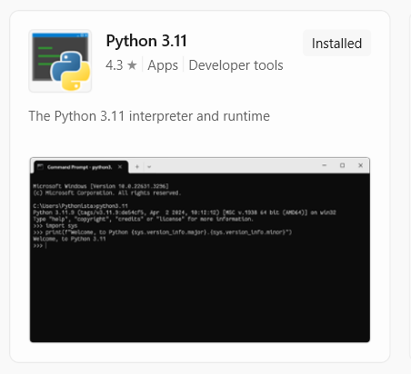
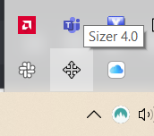
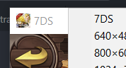
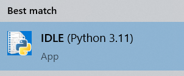
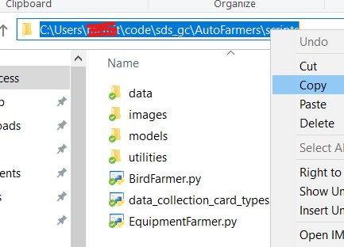
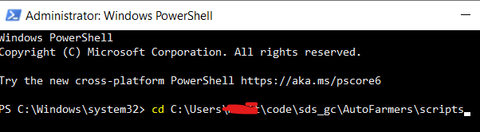
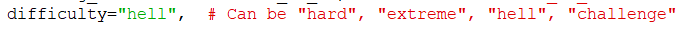

# 7DS Grand Cross scripts for auto-farming

This repository contains several scripts for auto-farming specific events in the 7DS Grand Cross mobile game.
For now it's built for Windows only, but it will change in the future.

**Disclaimer**: One downside of these scripts is that they cannot run in the background, i.e., you won't be able to use your PC while autofarming.
Also, use this code at your own risk.

**Disclaimer 2**: These scripts don't work on 4k monitors for reasons yet unknown.

### Installation

Follow these steps:

1. Download the code either by downloading manually (at the top, click on `Code->Download ZIP`) or by using GIT in PowerShell: `git clone https://github.com/PhantomPilots/AutoFarming.git`.
2. Install Python 3.10 or higher from the Microsoft Store: 
 
3. After Python is installed, we need to install some additional modules for the scripts to work. To do so, follow these steps:
   1. Open the AutoFarming folder.
   2. While pressing the `SHIFT` key, right-click inside the folder and then click on `Open PowerShell window here`.
   3. Once the terminal opens, paste the command: `python -m pip install -r requirements.txt` and press `ENTER`.

#### Sizer

Download and install the [Sizer](https://www.brianapps.net/sizer/) application for custom re-sizing of windows. 
Once installed, open it as administrator and:
1. Set the game in ***portrait*** mode instead of landscape mode (in-game settings).
2. Open Sizer. It's hidden at the bottom-right of your screen: 
 
Right-click on it and select `Configure sizer...`.
3. In Sizer, create a custom size of `540x960` and name it 7DS (first time only).
4. Right-click on the border of the 7DS window and choose the custom size to resize the window: 
 
**This needs to be done ever time you want to run a script**.

#### Git

To keep up-to-date with any updates, you'll need to install [Git](https://gitforwindows.org/) for Windows. Simply download the executable and install it.

### Code updates

Updating the code is done using Git. The process is simple:
1. Similarly to Installation point 3., open a PowerShell window on the AutoFarming folder.
2. Type in `git pull` and press `ENTER`.

### How to run the scripts

#### Python IDLE

All scripts require being run as administrator. One way to do so is the following:
1. Press the Windows key and type "IDLE". If Python is installed properly, you should see the IDLE app:  
 
Right-click on it and run it as an administrator.
2. Click on `File -> Open...` and load the script you want to run.
3. To run the script, press the `F5` key while the 7DS window is **fully visible** on the screen.
4. To stop the script, close the new window that appeared after the previous point (where blue text is being written down).

#### PowerShell

Using the Python IDLE is easier, but it doesn't allow for `CTRL+C` to kill some scripts (like the `BirdFarmer.py`). Using PowerShell is a better alternative:
1. Open PowerShell with administrator privileges.
2. Navigate to the folder where you host the scripts. To do so, copy the path location: 
 

3. Paste the location in PowerShell, preceded by `cd `, and press `Enter`: 
 

4. Finally, type into PowerShell: `python BirdFarmer.py` (or whatever script you're trying to run).
5. Now, to stop any script you can simply press `CTRL+C`.

Happy farming!

## Equipment farming script

A script that probably no one needs but me, `scripts/EquipmentFarmer.py` farms gear to extract blue stones while auto-salvaging whenever the equipment inventory becomes full. Then it goes back to farming. 

Requirements for it to work properly:
1. Have the "auto-farming" option of free stages set to 'infinite' with auto-renewal of stamina pots.
2. Have the desired farming team set.
3. Ensure the salvaging options on tavern-Diane are the desired ones.
4. Start from the tavern to avoid code malfunctions, but you should be able to start from anywhere.

## Hraesvelgr farming script

Now, this script is far more interesting for the majority of the community. It's named `scripts/BirdFarmer.py`, and it does what its name says: It farms the bird uninterruptedly, even when stamina is depleted or a fight is lost.

Requirements:
1. Start by being in a screen that's in the path of going to the bird (i.e.: tavern, battle menu, or bird menu).
2. Have the team ready with the proper gear. This doesn't mean "saved" (this will be handled by the script automatically), but rather just set up before clicking the "Save" button.

## Final Boss farming script

It's in `scripts/FinalBossFarmer.py`, and it accepts all difficulties. To change the difficulty, simply change the desired difficulty name in the script. It may default to either "challenge" or "hell", pay attention in which one you want:

## Troubleshooting

If the script doesn't work as expected (e.g., not clicking anywhere), make sure the game window is resized with the custom size created at the beginning.

The scripts don't account for random pop-ups (such as demon invitations), so make sure you have those notifications disabled.

## Shorter-term features
- [X] Consider attack-debuff and buff cards in the battle AI.
- [X] Consider buff cards.
- [ ] Consider card moves in the AI.

## Longer-term features

- [ ] Implement a farmer for Floor 4 of Bird (WIP).
- [ ] Allow starting the scripts from ANYWHERE.
- [ ] Make the scripts independent of the window size (i.e., scale-invariant).
- [ ] If the 'auto' button is available and OFF, click on it and disable the battle fighter (for fights other than demonic beasts).
- [ ] Make them work in 4k monitors.

## License
This project is licensed under the MIT License - see the [LICENSE](LICENSE) file for details.
