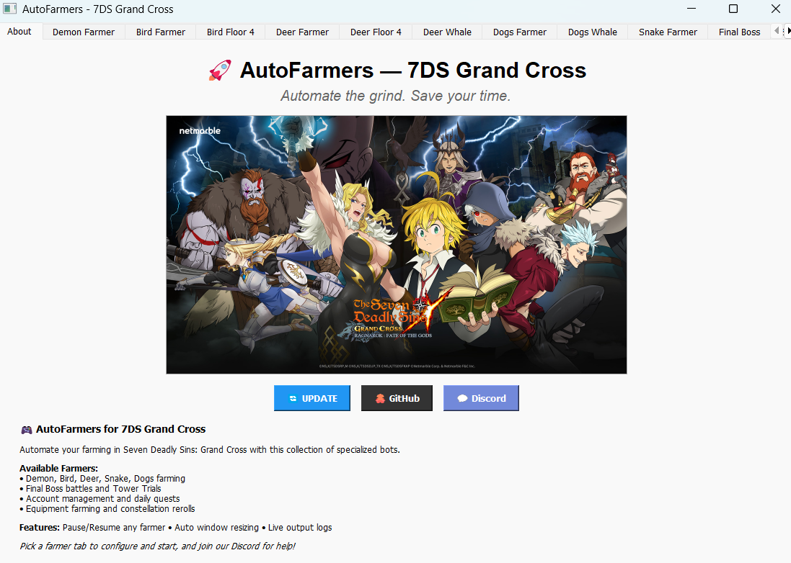

# 7DS Grand Cross scripts for auto-farming

This repository contains several scripts for auto-farming specific events in the 7DS Grand Cross mobile game.
For now it's built for Windows only, but it could change in the future.

**Disclaimer**: One downside of these scripts is that they cannot run in the background, i.e., you won't be able to use your PC while autofarming.
Also, use this code at your own risk.

## Samples

## Discord

Join the community if you want quick replies to issues, have new feature requests, etc.: https://discord.gg/En2Wm6a5RV

## Requirements

* Works on the official 7DS PC Beta Client: https://7dsgc.netmarble.com/en/pcclient.
* Disable "landscape mode" in Settings within the game (that means, enable portrait mode).
* Set the game in English!
* Disable all notifications within the game (e.g., random battle invites.)

## Installation

#### Git

To keep up-to-date with any updates, you'll need to install [Git](https://gitforwindows.org/) for Windows. Simply download the executable and install it.

#### Python 

Install Python <b>3.10</b> or <b>3.11</b> from the Microsoft Store: 
 

#### Download the code

1. After you have installed Git from above, open a folder where you want to download the code.
2. While pressing the `SHIFT` key, right-click inside the folder and then click on `Open PowerShell window here`.
3. Once the terminal is open, simply copy the following command and right-click inside the terminal to paste it:  
`git clone https://github.com/PhantomPilots/AutoFarming.git` 
and press `ENTER`.
This downloads the code into a folder named _AutoFarming_.

#### Additional Python modules
Now we need to install some additional Python modules for the scripts to work. To do so, click on `install.bat` that is within `scripts`.

### Code updates

Updating the code is done using Git. The process is simple:
1. Similarly to Installation point 4.2., open a PowerShell window within the AutoFarming folder.
2. Type in `git pull` and press `ENTER`.
   * If when running `git pull` you get an error/warning saying the code cannot be updated, first run `git stash` and then `git pull` again. You should now see the code updated.

### How to run the scripts

For a more user-friendly experience, you can use the **AutoFarmers GUI** which provides:

- **Tabbed Interface**: Easy access to all farmers in one window
- **Real-time Output**: Live terminal output for each farmer
- **Argument Configuration**: Simple forms for setting parameters
- **Process Management**: Start/stop buttons for each farmer
- **Visual Interface**: No need to remember command-line arguments

**To use the GUI:**
1. Inside `scripts`, click on `main.exe`. This should open an interface to interact with.
5. Select the farmer tab you want to use
6. Configure the arguments in the left panel
7. Click "START" to begin farming
8. Monitor progress in the terminal output window
9. Click "STOP" when finished

**NOTE**: If during the farming the bot starts working in weird ways, most likely it's because the 7DS window has auto-resized to the wrong size. To restore the right size, use the "Resize" button.

The GUI supports all available farmers including Bird, Deer, Dogs, Snake, Demon, Final Boss, Tower of Trials, etc.

Happy farming!

## Farming scripts

For detailed information on all the bots available, go to the [bots README file](BOTS_README.md).

## Troubleshooting

* The scripts don't account for random pop-ups (such as demon invitations), so make sure you have those notifications disabled.
* If when updating the code with `git pull` you get an error/warning saying the code cannot be updated, first run `git stash` and then `git pull` again. You should now see the code updated.
* For more errors, please open a new "issue" in the "Issues" tab of this website.

## Shorter-term features
- [X] Farmer for Bird Floor 4.
- [X] Farmer for Deer Floor 4.
- [X] Farmer for floors 1-3 of Deer.
- [X] Farmer for floors 1-3 of Dogs.
- [X] Farmer for floors 1-3 of Snake.
- [X] Bot for all daily missions.
- [X] Farmer for Indura Extreme.
- [X] Farmer for Indura Hell.
- [X] Farmer for Indura Chaos.
- [X] Unify all farmers in a single GUI.
- [ ] Buy daily stamina pots with friend coins, and get friend coins from mail.

## Longer-term features

- [ ] Allow starting the scripts from ANYWHERE.
- [ ] Make the scripts independent of the window size (i.e., scale-invariant).
- [ ] Make them work in 4k monitors.

## License
This project is licensed under the MIT License - see the [LICENSE](LICENSE) file for details.
